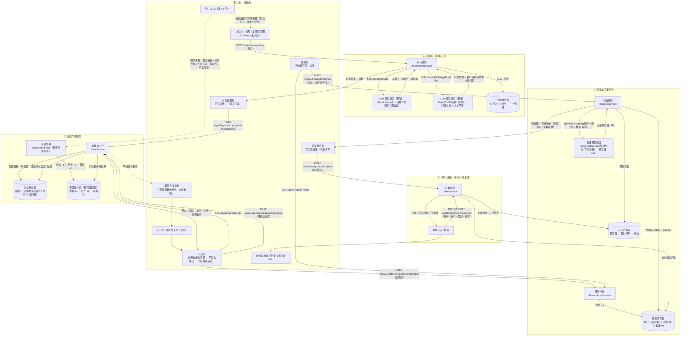

# 抖音花园：端到端流程图与接口设计（v0.1 草案）

> 依据：`0725-流程图草图.pdf`（用户旅程 + 后端毛胚）、`0725-用户旅程&产品设计草案.md`（已确认口径）。
> 范围：仅按现有已确认状态设计；待确认项（资源阈值、文案库等）以参数/配置形式预留，不展开。
> 约定：路径参数写作 `:id`；所有模型调用统一收敛在 **AI Gateway** 之后，便于 mock、降级与成本控制。

---

## 1. 端到端流程图



---

## 2. 模型接口契约（AI Gateway 后统一收敛，均为预留接口）

### 2.1 VLM —— 花卉识别（预留）

```jsonc
// POST {ai-gateway}/vlm/flower:identify
// 请求
{ "image_url": "https://cdn.../uploads/abc.jpg", "trace_id": "tr_01J..." }
// 响应
{ "species": "玫瑰", "main_color": "红", "secondary_color": "粉", "confidence": 0.93 }
```

### 2.2 LLM —— 科普文案 + 生长节律生成（预留）

> 依赖 VLM 的品种输出，串行调用。生长节律生成后落库为静态数值参数，运行时不再调模型。

```jsonc
// POST {ai-gateway}/llm/flower:profile
// 请求
{ "species": "玫瑰", "main_color": "红", "secondary_color": "粉" }
// 响应
{
  "science_text": "玫瑰，蔷薇科蔷薇属……",
  "growth_rhythm": {
    "stages": [
      { "stage": "seed",    "water": 1, "sunlight": 0, "nutrient": 0, "buffer_hours": 2 },
      { "stage": "sprout",  "water": 2, "sunlight": 1, "nutrient": 0, "buffer_hours": 6 },
      { "stage": "seedling","water": 3, "sunlight": 2, "nutrient": 1, "buffer_hours": 12 },
      { "stage": "bud",     "water": 4, "sunlight": 3, "nutrient": 2, "buffer_hours": 24 },
      { "stage": "bloom",   "water": 0, "sunlight": 0, "nutrient": 0, "buffer_hours": 0 }
    ]
  }
}
```

### 2.3 生图模型 —— 写实花束预览图

```jsonc
// POST {ai-gateway}/image:bouquet
// 请求（品种 + 颜色为硬约束，来自花房库存快照）
{
  "items": [ { "species": "玫瑰", "color": "红", "count": 3 }, { "species": "洋甘菊", "color": "白", "count": 5 } ],
  "style": "photorealistic",
  "aspect_ratio": "1:1"
}
// 响应
{ "image_url": "https://cdn.../bouquets/xyz.png", "seed": 20250725 }
```

---

## 3. REST API 清单

| # | Method | Path | 说明 |
|---|---|---|---|
| 1 | POST | `/api/v1/recognitions` | 上传图片识花（multipart）；内部串行调 VLM→LLM；返回 recognitionId、品种/主辅色、科普文案 |
| 2 | POST | `/api/v1/gardens/:gid/plants` | 把识别结果种进指定花园；品种与颜色自此锁定；返回 plantId、初始阶段 seed |
| 3 | GET | `/api/v1/gardens/:gid` | 花园聚合视图：植株阶段与缺口、三种资源数量、资源来源事件（「你们今天互相说过话，获得 1 滴水」） |
| 4 | POST | `/api/v1/gardens/:gid/plants/:pid/care` | 「照料这朵花」：将已积累资源作用于花朵，返回资源消耗明细与阶段变化；幂等键防连点重复扣减 |
| 5 | POST | `/api/v1/gardens/:gid/plants/:pid/press` | 盛放后压花收藏，收入花房（库存数量 +1） |
| 6 | GET | `/api/v1/flower-house` | 花房库存列表（品种、颜色、数量） |
| 7 | POST | `/api/v1/bouquets/preview` | 按所选花材调生图模型生成写实预览图 + 花材清单；只读库存快照校验，**不消耗花材** |
| 8 | POST | `/api/v1/bouquets/:bid/orders` | 花束方案发送花店；事务内扣减花材（乐观锁防超发），生成订单并推送给商家 |
| 9 | POST | `/webhooks/local-life/orders` | 履约状态回调：接单 / 制作中 / 配送中 / 完成 |
| 10 | GET | `/api/v1/gardens/entry-badge` | 聊天入口「花园有新的变化」提示状态（轮询或推送通道下发） |

内部链路（不对外）：聊天互动事件 → 消息队列 → `ResourceService` 按花园结算水滴/阳光/养料；阶段条件满足时产出「花园新变化」事件驱动 #10。

---

## 4. 核心数据表（对齐 PDF 后端草图，随 MD 口径演进）

| 表 | 关键字段 | 来源 |
|---|---|---|
| `flower_attribute` 花的属性 | species(PK)、main_color、secondary_color、growth_rhythm(JSON) | PDF 后端草图 |
| `plant` 生长状态 | plant_id(PK)、garden_id、species、stage、need_water、need_sunlight、need_nutrient、buffered_until | PDF 后端草图「还需多少滴水/阳光/养料」 |
| `resource_account` 资源账户 | garden_id(PK)、water、sunlight、nutrient（均 Int，按花园隔离） | PDF 后端草图 |
| `resource_event` 资源来源事件 | id、garden_id、type(互发消息/分享视频/连续互动)、delta、occurred_at | 支撑 MD「资源应向用户说明来源」 |
| `flower_house` 花房库存 | id(PK)、garden_id、species(Str)、color(Str)、quantity(Int) | PDF「仓库」→ MD「花房」 |
| `bouquet` 花束方案 | id(PK)、items(JSON 花材清单)、preview_url、status(draft/sent) | PDF「预览图 + 花材清单」 |
| `order` 订单 | id、bouquet_id、shop_id、status、回调时间线 | PDF「商家」履约 |

---

## 5. 关键工程决策

- **花材消耗时点**：preview 仅做库存快照校验；消耗发生在 #8 订单事务内（扣减 + 方案置 sent + 下单落库，同事务），与 MD「仅在发送花店时消耗」口径一致。
- **照料幂等**：`care` 携带幂等键（如 `garden_id + plant_id + client_action_id`），双击/重试不重复扣资源。
- **资源结算异步化**：聊天事件走队列聚合，按花园入账；花园页读取的是已结算账户 + 来源事件流水，不触碰聊天内容。
- **模型网关统一收口**：VLM / LLM / 生图三个接口均位于 AI Gateway 之后，Demo 期可用 mock 实现替换；LLM 生成的生长节律落库后即为静态配置，运行期零模型调用。
- **识花串行而非并行**：LLM 的科普与节律生成依赖 VLM 的品种输出，故 RecognitionService 内串行编排；科普文案超时可用品种模板兜底降级。
- **品种/颜色锁定**：`plants` 创建后其 species/color 不可变，后续成长只推进 stage，符合 MD 硬约束。
