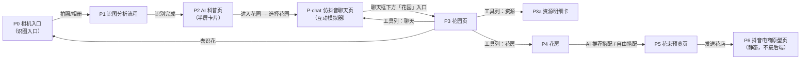

# 前端设计规范 · 抖音花园

> **v2.2 · 2026-07-25 · 用户审定**
>
> **效力声明**：本文件是抖音花园前端设计（页面结构、视觉、交互、组件、动效、文案呈现）的**最高权威文档**。前端设计与其他材料冲突时以本文件为准；业务规则、接口契约与数据口径的权威仍分别为《PRD.md》《API.md》——本文件只做呈现层规范，不改写业务口径；冲突且涉及业务时以《PRD.md》为最终裁决。
>
> **设计依据**：参照抖音识图页面与抖音"续火花"页面（`resources/UIUX_references/`）进行设计。文中色值除标注「采样」外均为按参考图校准的设计值，实现时可微调 ±2 阶但不得偏离色系。「花园」是「续火花」的延伸，花园域 UI/UX 应尽可能贴近续火花。
>
> **changelog**：
>
> | 版本 | 日期 | 修改人 | 变更摘要 |
> |---|---|---|---|
> | v1.0 | 2026-07-25 | 产品组（AI 助理协助编制，用户审定） | 初次带入设计规范（以旅行穿搭助手为模板） |
> | v2.0 | 2026-07-25 | 产品组（AI 助理协助编制，用户审定） | 按花园业务全面重写：确立"抖音内程序、页面栈导航、无全局 TabBar"架构；页面规范 P0–P7 全部改写为花园业务页面；统一地栽视觉资产；电商页定为纯前端静态原型 |
> | v2.1 | 2026-07-25 | 产品组（AI 助理协助编制，用户审定） | 花园域全面贴近"续火花"：内容图标改扁平暖色风；P3 花园页按花园参考图_2 重构；P3a 资源页改为底部上滑明细卡 |
> | v2.1.1 | 2026-07-25 | 产品组（AI 助理协助编制，用户审定） | P3 右侧工具列按钮解剖细化：白底图标卡 + 彩色衬底图标 + 独立白色胶囊标签 |
> | v2.1.2 | 2026-07-25 | 产品组（AI 助理协助编制，用户审定） | 「仓库」统一更名「花房」；P4 由白色整页改为底部上滑半屏卡（形态同 P3a） |
> | v2.2 | 2026-07-25 | 产品组（AI 助理协助编制，用户审定） | 按《0725-产品细化》调整：P2 CTA 改「进入花园」+ 选择花园卡；新增 P-chat 仿抖音聊天页（互动模拟器迁址，P3a 移除演示工具）；P3 改「我/TA」双人照料进度、提醒 TA 弹窗、成长动画、「查看完整成长旅程」；P4 动作面板双入口（AI 推荐搭配/自由搭配）与 ×0 灰卡「重新种植」；P5 增搭配说明/包装建议/备注/替代选项/赠送标记 |

---

## 0. 分工与变更管理

| 文档 | 管辖 | 效力 |
|---|---|---|
| **本文件** | 页面结构、视觉、交互、组件、动效、固定文案的呈现方式 | **前端设计最高权威** |
| 《PRD.md》 | 业务规则、旅程节点、功能口径、验收标准 | 全局最终裁决 |
| 《API.md》 | API 字段、错误码、响应结构 | 接口事实依据 |

- **修改流程**：本文件任何修改须经产品评审；涉及枚举/业务口径的，先改对应权威文档再回本文件同步；文件头 changelog 逐版记录。
- **反例纪律**：禁止以"参考图没有"为由删减 PRD 规定的业务元素；禁止在页面中加入 PRD 明确排除的能力。

## 1. 设计语言总纲

1. **抖音原生**：用户在抖音场景内使用本程序，全部页面沿用抖音原生交互语言（半屏卡片、双 tab、胶囊按钮），让用户感觉"没有离开抖音"。
2. **扁平优先**：无拟物、无厚重投影；层级靠**留白、字号、字重、灰阶**区分，不靠边框与阴影堆叠。花园场景（§3-P3）为唯一例外：土地与植物允许写实质感，但 chrome 元素仍保持扁平。
3. **极简配色**：白底 + 单强调色（抖音红）；深色仅用于相机/分析等画面层与浮标；不使用第二种强调色。花园场景的自然色（土壤、草皮、花朵色）属于内容画面，不计入强调色纪律。**花园页（P3）为唯一氛围例外**：允许续火花式柔粉渐变页底（`--bg-garden`），其 chrome 仍守单强调色纪律。
4. **内容优先**：图片与 AI 生成文案是主角，chrome（导航、按钮）收敛；图标轻点缀。
5. **半屏卡片**：核心业务页（AI 科普页）为"上屏画面 + 下屏白色半屏卡片（约 4:6）"结构，顶部拖拽把手 + 标题 + 右上 X 关闭。
6. **续火花亲和**：花园域（P3/P3a/P4/P-chat 及资源、花房相关元素）是"续火花"的延伸，布局、图标、卡片、提示条等一律向续火花页面语言靠拢。

**程序形态（最高优先级，不得违反）**：

- 本产品是**抖音内的一个程序，不是独立 App**。**禁止全局底部 TabBar**；页面一律采用页面栈导航（进入/返回），返回与关闭遵循抖音小程序式 chrome（左上返回 / 右上 X）。
- **入口只有两类**：① 相机（识图入口，P0）；② 聊天页花园入口（本期以 P-chat 仿抖音聊天页呈现其叙事）。「进入花园」是 AI 科普页底部 CTA，不是入口。
- 花园内部不再有底部导航：花房、资源均为花园的**子界面**（§3-P3/P3a/P4）；花束预览、电商页均为流程内页面。
- **明确不做**：无语音输入；无画面圈选（框选为系统动画，用户不可干预）；无 AI 科普页底部对话输入条；不设计 PRD 未定义的新页面层级；电商页不接任何真实交易交互（纯静态原型，§3-P6）；「广义的花」（规则待定）。

## 2. 设计 Tokens

### 2.1 色彩（值为参考图实测采样或校准）

| token | 值 | 用途 | 采样来源 |
|---|---|---|---|
| `--bg-page` | `#FFFFFF` | 卡片/页面主底 | 识图卡片（采样 #FFFFFF） |
| `--bg-dark` | `#110C17` | 相机/分析等深色画面层 | 加载页（采样 #110C17） |
| `--bg-feed-bar` | `#161616` | 画面层深色条 | feed 流底栏（采样 #161616） |
| `--bg-garden` | 柔粉渐变（约 `#FCEBF0 → #F4DCE5`） | 仅 P3 花园页页面底 | 花园参考图_2 页面底色 |
| `--banner-tip` | 浅黄（约 `#FDF0C8`） | 提示条底（badge/运营提示） | 花园参考图_2 提示条 |
| `--ink-primary` | `#161722` | 主文本、选中 tab、粗体 | 正文墨迹（采样 #161722） |
| `--ink-secondary` | `#4F5158` | 未选 tab、次级文本 | tab 未选（采样 #4F5158） |
| `--ink-tertiary` | `#8A8B99` | 占位、辅助小字、时间戳 | 校准值（截图辅助灰） |
| `--skeleton` | `#F0F6FE` | 骨架屏横条 | 识图骨架条（采样 #F0F6FE） |
| `--handle` | `#CFD0D2` | 卡片顶部拖拽把手 | 把手（采样 #CFD0D2） |
| `--close-bg` | `#F4F3F4` | X 关闭按钮圆形底 | X 按钮（采样 #F4F3F4） |
| `--accent` | `#FF2D62` | 主强调：CTA、选中态 | 券后价胶囊（采样 #FF2D62） |
| `--accent-deep` | `#FF003C` | 价格大字、渐变深端 | 商品价格（采样 #FF003C） |
| `--accent-cta` | 渐变 `#FF3949 → #FF4E59` | 底部主按钮 | CTA 按钮（采样两端值） |
| `--accent-soft` | `#FFF1F0` | 浅粉强调底 | 采样 #FFF1F0 |
| `--info` | `#139AFD` / 底 `#E5F5FF` | 信息 chip | 采样两值 |
| `--badge-pink` | `#E8568C`（采样边缘 #C25681） | 图标角标 | 图标参考图 |
| `--float-pill` | 黑 60% 不透明（≈`rgba(0,0,0,.6)`） | 浮标胶囊、toast | 浮标（采样混色 #69655D，基底 #0E1017） |
| `--star` / `--star-badge` | 黄星（约 `#FFC531`）/ 红角标（约 `#FF5A45`） | 续火花式奖励/任务图标 | 图标设计参考.jpg |
| `--success` | `#57B25E` | 照料完成态 ✓、已完成文案（内容色，非强调色） | 校准值 |
| `--soil-*` / `--grass-*` | 花园场景专用色板（实现时校准并补录回本表） | 仅花园场景画面 | 花园参考图 + 真实土壤/草皮校准 |

**配色纪律**：强调色仅 `--accent` 一族；AI 内容区不使用彩色标题（靠字重与灰阶）；花园场景自然色仅出现在场景画面内；续火花式内容图标的暖色与 `--success` 完成绿属于内容色，不计入强调色纪律。

### 2.2 字体与字号阶梯

系统字体栈：`-apple-system, PingFang SC, Helvetica Neue, Noto Sans SC, sans-serif`。

| 层级 | 字号（CSS px，基准 393pt 宽） | 字重 | 用途 |
|---|---|---|---|
| Display | 34–40 | 700 | 大数字、品牌字 |
| Title | 18–20 | 700 | 卡片区块标题 |
| Tab | 17 | 700（选中）/ 400（未选） | 双 tab |
| Body | 16 | 400/700（关键词加粗） | AI 回答正文、题目 |
| Caption | 13–14 | 400 | 辅助说明、chip、清单行 |
| Mini | 11–12 | 400 | 角标、时间戳、底部小字 |

行高：正文 1.55；标题 1.3。数字与「¥」符号同字重，¥ 字号为数字的 60%。

### 2.3 圆角 / 间距 / 阴影 / 图标

| token | 值 | 用途 |
|---|---|---|
| `--radius-pill` | 999px | 胶囊按钮、浮标、chips、输入框 |
| `--radius-card` | 16px | 半屏卡片顶部两角、内容大卡 |
| `--radius-inner` | 8–12px | 缩略图、库存格子图、花束图、工具方钮 |
| `--space-page` | 16px | 页面左右边距 |
| `--space-block` | 24px | 区块纵向间距 |
| `--space-item` | 12px | 列表项间距 |
| 阴影 | 仅浮层：`0 4px 16px rgba(0,0,0,.08)` | 展开更多按钮、弹窗、工具方钮；内容卡片不用阴影 |
| 图标 · chrome | 圆角线性（≈2px 描边、端点圆润） | 返回、X 关闭、更多等系统导航图标 |
| 图标 · 内容 | **续火花扁平风**：圆润饱满、暖色、可带柔和渐变与浅色衬底圆角块；资源类（水滴/阳光/养料）= 浅色衬底 + 饱和扁平图形；奖励/任务类 = 黄星（`--star`）+ 红色 +N 角标（`--star-badge`）；数量角标 = 粉底白字胶囊（`--badge-pink`） | 花房、资源、水滴、阳光、养料、互动事件、聊天、相机等花园域功能图标（参照图标设计参考.jpg） |

## 3. 页面规范

页面编号 P0–P6 + P-chat + 弹窗层 P7。页面流转（页面栈，无 TabBar）：



### P0 相机入口页（识图入口）

- 深底 `--bg-dark` 整页（抖音相机语境）；中央下方大号虚线胶囊大卡（+ 图标，主文案「拍照识花」、次文案「或从相册上传」），支持相册/拍摄两种方式；约束 Caption「JPEG/PNG，≤10MB」。
- 顶部无导航；左上 X 关闭（演示环境 = 回到页面栈上一页或停留在本页）。
- 选定图片后立即进入 P1。

### P1 识图分析流程（全屏，按参考图复刻）

- **状态一 · 扫描**（对应 2_分析动画）：所拍图片全屏铺满 + 整体压暗（黑 35–45% 遮罩）；白色扫描光点（直径 6–10px、白色 60–80% 不透明）在画面上随机位置浮动闪烁；底部居中深色胶囊「取消」（`--float-pill`），点击中断并回 P0。
- **状态二 · 框选**（对应 2_框选分析）：约 0.8s 后出现白色圆角括弧框（2px 描边、四角延伸），从画面边缘收缩锁定至画面中央主体区（无真实 CV，框选区域为中心加权模拟，动画约 600ms）；光点持续；左上角淡入识别帧圆角缩略图（56px，`--radius-inner`）。
- **状态三 · 卡片上滑**（对应 2_框选_1 → 3_识图_1）：下屏白色半屏卡片上滑进入，标题栏 + 「AI 正在生成回答 …」状态行 + 骨架横条（§4.4），框选框渐隐。
- 节奏：即使接口已返回，扫描→框选→上滑的引导动画保底约 2s（引导性场景动画不受 §6 的 300ms 上限约束；组件级动效仍受限）。

### P2 AI 科普页（对应 3_识图_1 → 3_识图_2）

- **骨架**：上屏所拍花图（约 40%）+ 下屏白色半屏卡片（`--radius-card` 顶角 + 拖拽把手）；卡片顶部 = 标题「识图结果」（Tab 级字重，**不设 tab**）+ 右上 X（`--close-bg` 圆底，点击 = 放弃本次识别、回 P0）。
- **手势**：拖拽把手或上滑卡片，在两个吸附档位间切换：初始 4:6（3_识图_1）→ 展开约 2:8（3_识图_2）；松手吸附，动画 ≤300ms。
- **内容区（纵向滚动）**：
  - 状态行：加载中 = **「AI 正在生成回答 …」**；完成后 = **「AI 生成回答」**（「AI」粗体 `--ink-primary` + 其余 `--ink-secondary`）。
  - 品种名（Title 700）+ 主色/辅色 chips（Caption，浅灰底 `--close-bg`）+ 置信度 Caption（`--ink-tertiary`）。
  - 科普正文（Body，行高 1.55）。
  - 「养护要点」小节：emoji + Title 小节标题 + 编号列表；内容长时截断渐隐 + 居中「展开更多 ∨」白胶囊按钮（§4.3）。
  - 「种入花园后的成长形态」横排图条：种子→萌芽→幼苗→花苞→盛放 5 张地栽版阶段图，横滑可览，Caption 标注阶段名。
- **底部固定主按钮**：**「进入花园」**（§4.1）。点击 → **选择花园半屏卡**（自底部上滑：标题「选择花园」+ 右上 X；选项行 = 花园图标 + 「我和小葵的花园」+ 右侧选中圆点；点击选项 = 调种植接口 → toast「已种到我的花园」→ 进入 **P-chat**）。

### P-chat 仿抖音聊天页（互动模拟器 · 聊天入口叙事）

- **性质**：演示环境复刻抖音聊天页（评委由此理解"资源来自聊天"与"聊天框下方花园入口"两个产品叙事）。
- **结构（白底整页）**：
  - 顶部标题栏：左返回（→ P3 或页面栈上一页）+ 居中「小葵」（Tab 级字重）+ 其下 Mini 灰字「伴侣火花 · 关系花园」（`--ink-tertiary`）。
  - 消息流（纵向滚动，预置 2–4 条消息）：小葵（左泡，浅灰底 `--close-bg`）/ 我（右泡，`--accent-soft` 底）；预置内容如小葵「今天路过看到一片向日葵，好好看」、我「拍下来啦，已经种进我们的花园 🌻」。
  - 底部固定区（自上而下）：
    1. **模拟输入条**：胶囊灰底（`--close-bg`）占位「发消息…」（`--ink-tertiary`），不可输入；
    2. **「花园」入口条**：白底横条（花朵扁平图标 + 「花园」+ 右侧「>」），点击 → P3；
    3. **Demo 互动模拟器**：浅灰分区（顶部 Caption 灰字「Demo 互动模拟器 · 点击模拟聊天互动」），三个浅橙胶囊按钮横排：**「互发消息」「分享视频」「延续互动」**（调用 API 1.11）。
- **互动反馈**：点击模拟器后——消息流追加对应模拟消息（互发消息 = 左右各一条文本泡；分享视频 = 视频卡泡，圆角卡 + 居中播放三角 + Caption「分享视频」；延续互动 = 居中系统灰条「你们已连续互动 3 天」）+ toast 展示资源来源文案（接口 `event.description` 原文）。

### P3 花园页（续火花主页面形态，参照花园参考图_2）

- **页面底**：`--bg-garden` 柔粉渐变整页；页面纵向滚动，自上而下：顶部栏 → 花园场景 → 花园题注 → 提示条（badge）→ 白色卡片区。
- **顶部栏**：左上 = 双人叠放头像（「我」「葵」占位、白色描边、左压右微重叠）；右上 = 「···」白底圆形按钮（点击 toast「更多玩法敬请期待」）。
- **右侧工具列**（复刻续火花「道具卡 / 火花日签」）：场景右上区域竖排三个工具按钮（间距 20px），每个 = 白底圆角图标卡（56px，`--radius-inner`、浮层阴影，彩色衬底图标约占 75%）+ 下方独立白色胶囊标签（`--radius-pill`、白底、浮层阴影、12px `--ink-primary`）——**「花房」**（→ P4）、**「资源」**（→ P3a）、**「聊天」**（→ P-chat）。
- **花园场景（中央主视觉）**：等距 2.5D 土地块悬浮于渐变页底之上（无独立场景面板）；草皮顶面 + 土层侧面真实感要求不变；每株花按当前阶段以**地栽版**资产栽在土里；点击某株 = 选中（地面光圈高亮 + 轻微上浮），联动下方「植株卡」；场景上沿资源条：三枚白色胶囊（资源扁平图标 + **我的储备**数量），点击进 P3a。
- **花园题注**：场景下方居中 Caption（`--ink-secondary`）：「我和小葵的花园 · 共种下 n 朵花」（n = 未收藏植株数）。
- **提示条（badge）**：浅黄底（`--banner-tip`）、左侧灯泡扁平图标、正文 Caption **「花园有新的变化，去看看吧」**、右侧 X 可关闭；仅在 badge 有更新时出现，点击正文刷新并消失。
- **白色卡片区**：
  - **植株卡**（选中后展示）：阶段图 + 阶段名（Title）+ 下一阶段目标 Caption →
    **「我 / TA」并列进度块**（两行，参照下列版式；✓ = `--success` 对号图标，✕ = `--handle` 灰叉；完成态文字 `--success`，等待中 `--ink-tertiary`）：
    ```
    我的照料：水滴 ✓  阳光 ✓  养料 ✓   已完成
    TA 的照料：水滴 ✓  阳光 ✕  养料 ✓   等待中
    ```
    → **状态提示语**（Caption，`--ink-secondary`，按状态动态给出，如「你已完成今天的照料，等 TA 的资源到位，这朵花就会长大」「资源不足时，去聊天页互动获取吧」「花朵正在成长，去看看吧」）→
    **主按钮「照料这朵花」**（§4.1）：点亮条件 = 接口 `me.can_care`（我未完成且储备达标）；不满足时灰置禁用 + 下方 Caption 说明原因（缺口或「你已完成，等待 TA 照料」）；`bloom` 且未收藏时替换为 **「压花收藏」**；
    **提醒 TA 弹窗**：我完成照料且 TA 未完成时弹出（§P7 模态）——标题 **「提醒TA照料鲜花」**，正文「你已经完成这一阶段的照料，提醒 TA 也来照料这朵花吧」，主按钮 **「提醒 TA」**（点击 → toast「已提醒 TA，等 TA 来照料」，关闭弹窗）+ 次按钮「知道了」；
    **查看完整成长旅程**（Demo 专用，非 bloom 时可见）：植株卡底部次按钮（§4.3）→ 调快进接口 → **旅程弹窗**（全屏遮罩 + 白卡：五阶段图横向递进动画（种子→盛放，每档约 300ms）→ 标题「已盛放」+ Caption「这朵花经历了完整的成长旅程」→ 主按钮「去压花收藏」，关闭弹窗并选中该植株）。
  - **入口卡**：相机扁平图标 + 标题「再识一朵花」+ 副标题「看到喜欢的花，拍下来种进花园」+ 右侧 `--accent-cta` 胶囊「去识花」→ P0。
- **成长动画**：进入花园或照料刷新后，`stage_advanced_at` 晚于上次访问（localStorage 记录）的植株 → 场景花朵缩放生长动画（≤600ms）+ 植株卡高亮；动画后写入本次访问时间。
- **演示重置（「重新体验」）**：「···」菜单暂无；重置入口置于 P-chat 模拟器区（次按钮「重新体验」），点击 → 弹窗确认（标题「重新体验」，正文「将清空当前演示数据并恢复初始状态」）→ 调 reset 接口 → toast「已重置，欢迎体验」→ 回 P0。

### P3a 资源明细卡（底部上滑半屏卡，参照资源页参考图.jpg）

- **形态**：自花园页底部上滑的半屏卡片（遮罩黑 45%，上滑 300ms，高约 76%）；居中标题「**资源明细**」+ 右上 X（关闭 = 返回花园页）；卡片内容区纵向滚动。
- **余额条**：卡片顶部三枚资源余额横排（扁平资源图标 + Display 数量 + Caption 名称「水滴/阳光/养料」，为**我的储备**）。
- **明细列表**：每行 = 左侧圆形扁平图标（互动类型：互发消息 / 分享视频 / 连续互动火花）+ 中间事件文案（Body）与时间（Caption `--ink-tertiary`，精确到分）+ 右侧资源增量（对应资源小图标 + `+n`，数字 Body 700）；按时间倒序 ≤20 条；只展示事件，不涉及聊天内容。
- 不设「支出 / 收入」分段；**不再设演示工具区**（模拟器已迁址 P-chat）。

### P4 花房（底部上滑半屏卡，形态同 P3a）

- **形态**：自花园页底部上滑的半屏卡片（遮罩黑 45%，上滑 300ms，高约 76%）；遮罩点击与右上 X 均返回花园页；卡片内容区纵向滚动。
- **头部**：居中标题「花房」（Tab 级字重）+ 右侧 X；头部左侧为 **「AI插花」** 文字按钮（`--accent`）。
- **AI插花动作面板**：点「AI插花」自底部上滑小弹层（两个选项卡，点击后进入对应模式，面板外点击/X 关闭）：
  1. **AI 推荐搭配**（spark 扁平图标 + 标题「AI 推荐搭配」+ 副标题 Caption「告诉我送花意图，AI 帮你配」）→ **意图选择卡**（标题「送花意图」+ 5 个胶囊 chips 横排可换行：情侣约会 / 毕业季 / 生日祝福 / 探望问候 / 日常惊喜）→ 点选即调推荐接口 → **推荐结果卡**（「AI 生成回答」状态行 + 理由 Body + 花材列表（赠送项带 `--accent-soft` 底「赠送」chip）+ 底部主按钮「生成花束预览」）；
  2. **自由搭配**（花房扁平图标 + 标题「自由搭配」+ 副标题 Caption「自己挑选花材」）→ 进入多选态（同 v2.1.2：每格步进器 0–库存，头部「AI插花」位变「取消」，卡片内底部操作栏「已选 n 朵」+ 主按钮「生成花束预览」，0 朵禁用）。
- 库存网格：双列方格，每格 = 花朵特写图（1:1，`--radius-inner`）+ 品种·颜色（Caption）+ 数量角标（`--badge-pink` 粉底白字胶囊，右上角）；空态文案「还没有收藏的花朵，先去花园种一朵吧」。
- **×0 灰态卡**：quantity=0 项整卡灰化（灰滤镜 + 60% 透明度），角标「x0」；卡下方次按钮 **「重新种植」**（§4.3）→ 调复种接口 → toast「已重新种下，去花园看看吧」（停留本页，便于继续操作）。
- 库存不足等错误以 toast 提示（§P7）。

### P5 花束预览页

- 半屏卡片结构：上屏 = AI 生成花束预览大图（约 45%，可点按放大），下屏白色卡片（把手 + 标题「花束方案」+ 右上 X = 返回 P4 重选，不消耗）。
- 内容（纵向滚动）：「AI 生成回答」式状态行（生成中 = 「AI 正在生成回答 …」+ 骨架）→ **搭配说明**（Body）→ **轻量建议**（如有：`--accent-soft` 底提示条，Caption）→ 花材清单（每行：品种 · 颜色 × 朵数；赠送项带「赠送」chip；末尾合计 Caption）→ **包装建议**（Caption 行，`--ink-secondary`：「包装建议：…」）→ 提示 Caption（`--ink-tertiary`）：**「预览不消耗花材，发送花店后才会扣除」**。
- **发送信息区**：备注输入框（胶囊输入框，`--close-bg` 底，占位「给花店捎句话（选填）」）+ 勾选项行（圆形勾选 + Caption「接受相似花材替代」，默认勾选）。
- 底部固定区：主按钮 **「发送花店」**（§4.1，携带备注与替代选项调下单接口）+ 次按钮「返回调整」（§4.3）。

### P6 抖音电商原型页（本地花店 · 静态原型）

- **性质**：只读静态原型页（仿抖音电商/本地生活订单页观感），**不接入后端**：所有内容为前端硬编演示数据（集中管理便于巡检）。
- **结构（轻量版，后续按用户调整方案迭代）**：顶部导航（左返回 + 标题「订单详情」）→ 店铺条（店铺图标 + 「春风花店」+ Caption「抖音本地生活 · 演示」）→ 商品卡（花束预览图 1:1 + 「AI 定制花束 · 同款鲜花」+ 花材摘要 Caption（含「赠送」标记）+ 金额 `--accent-deep`）→ 发送信息（包装建议 / 用户备注 / 「接受相似花材替代」选项态，Caption 行）→ 履约时间线（四节点竖向：花店已接单 → 花束制作中 → 骑手配送中 → 已送达，当前及以前节点 `--accent` 高亮）→ 送达态底部横幅 **「收到同款鲜花花束，旅程闭环 🎉」** → 页面底部 Mini 灰字 **「演示原型，不构成真实交易」**。
- 按钮可有点击态但无跳转/无下单。

### P7 弹窗与 toast（异常与提示层）

- **模态弹窗**：居中白卡（`--radius-card`，宽 76%），标题 Body 700 + 正文 Body + 主按钮（胶囊，`--accent-cta`）；遮罩黑 45%。用于：「提醒TA照料鲜花」（P3）、「重新体验」确认（P-chat）。
- **toast**：顶部下浮黑底白字胶囊（`--float-pill`），2s 自消：接口失败（可重试）、上传非法、网络异常、库存不足与照料缺口（展示接口 `detail` 原文）、「更多玩法敬请期待」、「已提醒 TA，等 TA 来照料」、「已重新种下，去花园看看吧」、「已重置，欢迎体验」。
- 语气：简洁、动词开头、无技术术语；错误提示只说用户能做什么，不解释技术原因。

## 4. 组件规范

### 4.1 主按钮（CTA）

- 胶囊（`--radius-pill`，高 48px），底 = `--accent-cta` 渐变，文字白色 16px 700；整宽（页边距 16）或居中固定底栏。
- 按下态：透明度 0.85；禁用态：灰底 `--handle` + 白字。
- 用于：进入花园（P2）、照料这朵花 / 压花收藏（P3）、提醒 TA（P3 弹窗）、生成花束预览（P4）、发送花店（P5）、去识花（P3 入口卡）、去压花收藏（P3 旅程弹窗）。

### 4.2 tab 栏

- 左对齐双 tab：选中 = Tab 17px 700 `--ink-primary` + 下方短下划线（宽 20px、高 3px、圆角、`--ink-primary`）；未选 = 17px 400 `--ink-secondary`；间距 28px；切换带内容区横滑动效（§6）。
- 本期页面均未使用双 tab；本规范保留该组件定义备后续使用。

### 4.3 次按钮 / 展开更多 / chips

- 次按钮：白底胶囊，`--ink-primary` 描边 1px（或 `--close-bg` 浅灰底无描边），14–15px；用于「返回调整」「展开更多 ∨」「重新种植」「查看完整成长旅程」「重新体验」「知道了」；展开更多按钮居中、带 §2.3 唯一允许的浮层阴影。
- chips：胶囊，高 34px，padding 0 16px；未选 = `#F4F3F4` 底 + `--ink-secondary` 字；选中 = `--accent` 描边 + `--accent-soft` 底 + `--accent` 字；chips 组间距 8px，可换行。颜色标签 chip（P2）与「赠送」chip（P4/P5/P6）为只读展示，不可点。

### 4.4 骨架屏

- 横条：`--skeleton`，圆角 8px，高 14px；2–3 根（100% / 70% / 85% 宽），呼吸透明度动画 1.2s 循环；所有 AI 等待态统一使用（P1/P2 科普生成、P5 花束生成）。

### 4.5 缩略图与图片

- 识别帧缩略图：56×56，`--radius-inner`，灰底占位；花房格子图与花束预览图 1:1，`--radius-inner`。
- 图片加载：懒加载 + 骨架块占位；失败显示灰底占位图，不显示破图。

## 5. 文案规范

- **固定文案（逐字引用，禁止改写）**：「AI 正在生成回答」/「AI 生成回答」/「进入花园」（P2 CTA）/「选择花园」（选择卡标题）/「我和小葵的花园」（花园选项）/「已种到我的花园」（种植成功 toast）/「花园有新的变化，去看看吧」（提示条）/「我和小葵的花园 · 共种下 n 朵花」（P3 题注，n 为变量）/「照料这朵花」（P3 主按钮）/「压花收藏」（盛放后主按钮）/「已压花收藏，去花房看看吧」（压花成功 toast）/「提醒TA照料鲜花」（弹窗标题）/「提醒 TA」（弹窗主按钮）/「已提醒 TA，等 TA 来照料」（提醒 toast）/「你已完成今天的照料，等 TA 的资源到位，这朵花就会长大」（状态提示语）/「资源不足时，去聊天页互动获取吧」（状态提示语）/「查看完整成长旅程」（P3 次按钮）/「去压花收藏」（旅程弹窗主按钮）/「再识一朵花」/「看到喜欢的花，拍下来种进花园」/「去识花」/「更多玩法敬请期待」/「资源明细」（P3a 标题）/「Demo 互动模拟器 · 点击模拟聊天互动」（P-chat 标注）/「互发消息」「分享视频」「延续互动」（模拟器按钮）/「重新体验」（重置按钮与确认弹窗标题）/「将清空当前演示数据并恢复初始状态」（确认弹窗正文）/「已重置，欢迎体验」（重置 toast）/「AI插花」（P4 头部按钮）/「AI 推荐搭配」/「告诉我送花意图，AI 帮你配」/「自由搭配」/「自己挑选花材」/「送花意图」（意图卡标题）/「生成花束预览」（CTA）/「重新种植」（×0 灰卡按钮）/「已重新种下，去花园看看吧」（复种 toast）/「预览不消耗花材，发送花店后才会扣除」（P5 提示）/「给花店捎句话（选填）」（备注占位）/「接受相似花材替代」（勾选项）/「发送花店」（P5 CTA）/「收到同款鲜花花束，旅程闭环 🎉」（P6 送达横幅）/「演示原型，不构成真实交易」（P6 页脚）/「还没有收藏的花朵，先去花园种一朵吧」（P4 空态）/「点击花园里的一朵花，开始照料它」（P3 空态）。
- **语气**：简洁、动词开头、无技术术语；错误提示只说用户能做什么（重试/重新拍摄/更换），不解释技术原因。
- **AI 生成文案**：科普正文与养护要点每条一行、可执行、讲正向内容；搭配说明与推荐理由 ≤60 字、讲正向寓意。

## 6. 动效与过渡

| 场景 | 动效 | 时长 |
|---|---|---|
| P1 扫描光点 | 随机位置浮动闪烁（场景引导动画） | 持续循环 |
| P1 框选收缩 | 括弧框自画面边缘收缩至主体区（场景引导动画） | ≈600ms |
| P1 → P2 卡片上滑 | 半屏卡片自底部上滑进入 | 300ms |
| P2 上下屏档位切换 | 拖拽跟随，松手吸附至 4:6 / 2:8 | ≤300ms |
| P3a / P4 卡片上滑 | 遮罩淡入 + 卡片自底部上滑 | 300ms |
| P3 成长动画 | 场景花朵缩放生长（0.9→1.05→1.0）+ 植株卡高亮 | ≤600ms |
| P3 旅程弹窗阶段递进 | 五阶段图横向逐档点亮 | 每档 ≈300ms |
| 骨架 → 内容 | 内容渐显 + 自顶向下 8px 位移 | 250ms |
| 截断渐隐 + 展开更多 | 文字底部 24px 渐变遮罩；展开后高度动画 | 300ms |
| P3 照料动画 | 资源图标自资源条飞向植株 | ≤600ms |
| 弹窗 | 遮罩淡入 + 卡片 0.95→1.0 缩放 | 200ms |

原则：组件级动效 ≤300ms、可中断、不阻塞交互；无弹簧类夸张动效；P1 分析流程、P3 照料/成长/旅程为场景引导动画，按表内专属时长。

## 7. 布局与设备

- **设计基准**：1179×2556 @3x（iPhone Pro Max）→ CSS 逻辑 393×852；页面按流式布局适配 360–430pt 宽。
- 安全区：顶部状态栏避开；底部主按钮/操作栏避开 home 指示条（padding-bottom = env(safe-area-inset-bottom)）。
- 上下屏比例：P2 科普页 4:6（初始）/ 2:8（展开）；P3 花园页整页纵向滚动，场景主视觉约占首屏 45–55%；P3a / P4 卡片高度约占屏 70–80%；P5 花束页 图:卡片 ≈ 45:55；P-chat 底部固定区（输入条 + 花园入口 + 模拟器）总高约 180–220px。横屏与平板不做专门适配（居中 max-width 480px 即可）。
- 性能：首屏图片 ≤ 200KB 预算；花房网格图懒加载；骨架屏先于数据渲染。

## 8. 无障碍基线

- 正文对比度：`--ink-primary` on `#FFFFFF` ≈ 15:1；辅助灰 `--ink-tertiary` 仅用于非关键信息。
- 可点区域 ≥ 44×44pt（chips、工具方钮、步进器、提示条、模拟器按钮需扩展热区）；选中态不止依赖颜色（描边 + 字重/图标/光圈）。
- 动效遵循系统「减弱动态效果」设置（prefers-reduced-motion 时退化为透明度渐变；P1 扫描/框选、P3 成长/旅程动画简化为淡入淡出）。

## 9. 页面 ↔ 埋点映射

本项目暂未定义埋点需求；如需埋点，先改《PRD.md》再回本文件补录。

## 10. 交付边界

- 本文件不含具体实现代码；组件以样式与行为描述为准，前端按 §0 分工自行选型实现。
- **视觉资产口径**：成长阶段图（种子→萌芽→幼苗→花苞→盛放）与花朵特写全部统一为**地栽版**（土丘底座、无花盆、透明底），由 `server/app/ai_gateway/art.py` 生成；不存在盆栽变体。
- **电商页演示数据**（店铺、金额、履约状态、时间线、包装/备注/替代选项等硬编内容）在前端代码内集中管理（单一模块导出），便于演示前统一巡检。
- **P-chat 预置消息与模拟消息**为前端演示数据，与 P6 同样集中管理。
- 参考图与本文冲突时，以本文为准；参考图未覆盖的新组件（花园场景、资源条、工具列、双人进度块、模拟器等），按 §1–§2 语言延展并在评审时补录回本文件。

---

*文档完。本规范（v2.2）依据 `resources/UIUX_references/` 与《PRD.md》《API.md》编制，为抖音花园前端设计最高权威文档。*
